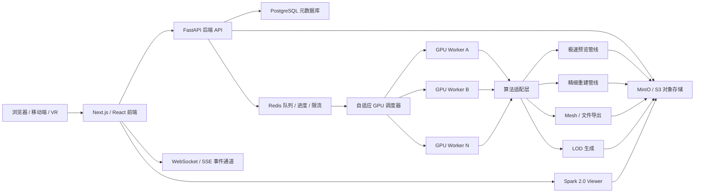

yy# 系统架构设计

## 1. 总体结构

系统采用前后端分离、任务异步化、GPU Worker 独立执行的架构。



## 2. 前端模块

| 模块 | 职责 |
| --- | --- |
| 首页 / 新建项目 | 默认入口，提供图片项目创建方式，显示系统资源和训练中项目 |
| 项目列表 | 展示项目、状态、创建时间、主要产物 |
| 项目详情 | 展示上传素材、任务进度、预览模型、导出入口 |
| 完整素材上传页 | 支持图片多选、视频上传、分片上传、补传、删除素材、缩略图大图预览和素材统计 |
| Viewer | 使用 Spark 2.0 加载 SPZ 或 RAD 模型，支持 LOD |
| 任务进度 | 通过 WebSocket 或 SSE 接收任务状态和进度 |
| 导出面板 | 发起 Mesh 导出，展示导出文件和下载链接 |
| 用户总览 | 展示项目总数、训练中数量、已完成数量和总占用 |
| 问题反馈 | 用户提交问题、截图、项目关联和联系方式 |
| 管理面板 | 展示 GPU、队列、Worker、用户存储和任务日志 |


## 3. 后端模块

| 模块 | 职责 |
| --- | --- |
| Auth | 用户认证和项目访问控制 |
| Project API | 项目创建、查询、更新、删除 |
| Upload API | 分片上传、合并、校验、对象存储写入 |
| Task API | 创建预览、精细重建、LOD、Mesh 导出任务 |
| Event API | 推送任务进度、状态变化和错误信息 |
| Storage Service | 封装 MinIO/S3 路径、签名 URL、生命周期策略 |
| Media Service | 管理项目原始图片、视频、缩略图、删除和补传 |
| Statistics Service | 统计用户项目数、存储占用、训练占用和系统资源 |
| Feedback Service | 保存用户反馈、附件和处理状态 |
| Scheduler | 从 Redis 获取任务并分配 GPU Worker |
| Worker Agent | 执行算法适配器、产物上传、日志回传 |
| Resource Monitor | 采集 CPU、GPU、显存、队列和 Worker 心跳 |


## 4. 算法适配层

算法适配层的目标是屏蔽各算法仓库的输入输出差异，让 Worker 只处理统一任务格式。

算法适配层必须调用真实算法代码。未安装算法、缺少权重、GPU 不满足要求，应返回明确错误，不能生成假产物标记任务成功。

### 统一输入

- `project_id`
- `task_id`
- `input_type`: `images`、`video`、`camera`
- `raw_uri`
- `work_dir`
- `pipeline`: `preview`、`fine`、`mesh_export`、`lod`
- `options`: 系统自动生成的执行参数

### 统一输出

- `status`: `succeeded` 或 `failed`
- `artifacts`: 产物清单
- `metrics`: 耗时、点数、帧率、质量指标
- `logs`: 关键日志路径
- `error`: 失败原因
- `suggestions`: 素材质量提示，例如建议补拍方向、模糊图片、覆盖不足区域

## 5. 算法管线

| 场景 | 管线 |
| --- | --- |
| 图片极速预览 | LiteVGGT → Spark-SPZ |
| 视频极速预览 | 待重写 |
| 实时摄像头 | 待重写 |
| 精细重建 | 默认 `mobilegs_lmrs`：AMB3R-SfM 生成无 EXIF 依赖的 COLMAP 兼容 SfM + DeblurMLP-MobileGS + FastGS-style VCD/VCP + patched LM-RS Compact Box rasterizer + 可选 LM-RS matrix-free Phase 2 + Spark-SPZ；pycolmap 仅显式诊断；预览仍使用 LiteVGGT |
| 稀疏视角 | FreeSplatter 初始化 → 精细合成引擎 |
| 长视频精细重建 | 待重写 |
| Mesh 导出 | MeshSplatting → `.ply` / `.obj` / `.glb` |
| LOD 生成 |

## 6. 调度策略

- 预览任务优先于精细重建任务。
- 轻量预览任务可以在同一 GPU 上并发执行。
- 精细重建和 Mesh 导出默认独占 GPU。
- 调度器每 1 秒读取 Worker 心跳、显存、利用率和任务状态。
- 任务失败后可根据失败类型决定是否重试，算法执行失败默认不盲目重试。
- 高并发场景下，上传、查询、事件推送和静态资源下载不能阻塞 GPU 任务调度。
- 多 GPU 场景下，调度器应记录每张 GPU 的显存、利用率、当前任务、预计释放时间，并按任务类型分配。

## 7. 部署建议

毕业设计阶段建议先实现单机可运行版本：

```text
frontend        Next.js / React
backend         FastAPI
database        PostgreSQL
queue/cache     Redis
object storage  MinIO
worker          Python GPU Worker
viewer          Spark 2.0
```

后续扩展到多机时，只需要增加 GPU Worker 节点，并让 Worker 连接同一 Redis、PostgreSQL 和对象存储。


## 8. GPU 预览链路同步

## 9. 渐进式渲染与 LOD 加载

- `GET /api/projects/{project_id}/viewer-config` 当前返回单个预览或最终模型；视频/实时视频渐进加载待新管线重新定义。
- Viewer 以 800 万 Gaussians 为默认预算，根据 FPS、网络状况和时间线位置自动降低远处/旧片段的 LOD 质量，目标保持 90 FPS。

## 2026-05-07 Fine Pipeline Update

- Fine reconstruction accepts ordinary JPG/PNG uploads. EXIF camera parameters are not required; EXIF is used only for orientation correction.
- Production fine path: JPG/PNG normalization -> AMB3R-SfM -> COLMAP-compatible sparse model -> DeblurMLP-MobileGS training -> optional LM-RS refinement -> Spark SPZ.
- AMB3R-SfM is the production fine SfM frontend. `pycolmap` remains only as explicit development diagnostics via `fine_sfm_backend=pycolmap`, never as automatic fallback. Deprecated fine `litevggt` maps to AMB3R.
- Preview LiteVGGT remains isolated under the preview vendor path. Fine AMB3R metrics include `sfm_backend=amb3r_sfm_colmap_no_exif`, registered/unmapped image count, resolution, and sparse point count.
- DeblurMLP uses the Deblurring-3DGS GTnet method at commit `e63366b8581c0fde2fda0ab1aea99518da2e2f10`. It models blurred observations during training and still exports a standard sharp Gaussian PLY.
- The worker image keeps one CUDA/PyTorch baseline, one patched LM-RS rasterizer, one `simple_knn`, and one `fused_ssim`.

## 2026-05-10 Image Fine EDGS/RoMA Update

- Image fine remains `mobilegs_lmrs`: JPG/PNG normalization -> AMB3R-SfM -> local EDGS/RoMA dense-correspondence Gaussian initialization -> DeblurMLP-MobileGS training -> optional LM-RS -> final PLY validation -> Spark SPZ.
- The backend does not clone or vendor the full EDGS repository. The only EDGS-specific code in this project is the minimal initialization adapter under `backend/app/fine/edgs_init.py` and `backend/app/fine/edgs_runtime/`.
- EDGS initialization runs after `Scene(...)` and before `gaussians.training_setup(opt)`. If the runtime or weights are missing, fine fails with an explicit runtime/weight error instead of silently falling back.
- EDGS is enabled by default. `fine_edgs_enabled=false` falls back to AMB3R sparse initialization and sparse point compensation.
- EDGS defaults are `matches_per_ref=15000`, `nns_per_ref=3`, `num_refs=len(train cameras)`, and `roma_model=outdoor`.
- When EDGS is enabled, MobileGS densification is disabled with `densify_until_iter=0`; final prune behavior remains.
- DeblurMLP uses a default 3000-iteration warmup. GTnet activates after warmup and xyz learning rate is scaled by `0.1` while DeblurMLP is active.

## 2026-05-10 Video Fine Pipeline Update

- Image fine reconstruction remains `mobilegs_lmrs`: AMB3R-SfM, DeblurMLP-MobileGS, optional LM-RS, final PLY validation, and Spark SPZ conversion.
- Video fine reconstruction uses canonical pipeline `video_artdeco_speed3r`. Legacy names `video_artdeco_litevggt`, `video_litevggt`, and `artdeco_litevggt` are aliases only.
- Video fine accepts exactly one uploaded video. The worker extracts frames, writes ARTDECO `selfCaptured` calibration, runs ARTDECO VSLAM plus Reconstruct h3dgsv3 mapper/training, validates `point_clouds/gs.ply`, copies it to `final.ply`, and converts `final_web.spz`.
- Speed3R-Pi3 is only the replacement for ARTDECO Pi3 inference in loop-closure matching. The video path does not call AMB3R, MobileGS, LM-RS, DeblurMLP, or LiteVGGT image preview.
- Missing video intrinsics use a pinhole default: centered principal point, focal `0.9 * max(width,height)`, and ARTDECO focal optimization enabled. Explicit user intrinsics override this.
- ARTDECO `bb654395826e50ac9e4671682d901377115a24ce` and Speed3R `5460f7309c87e5daac36385ff6611627de7d7267` are integrated as runtime source boundaries, not copied wholesale into backend app code.
