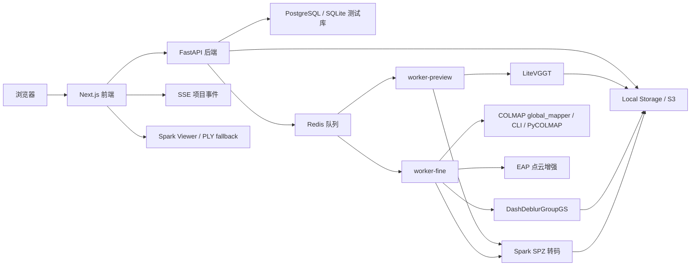

# 系统架构设计

## 1. 总体结构

系统采用前后端分离、任务异步化、GPU Worker 独立执行的单机 Compose 架构。



## 2. 前端模块

| 模块 | 职责 |
| --- | --- |
| `AppShell` | 认证状态、资源状态、导航、任务弹层 |
| 首页 `/` | 新建项目入口、系统资源和运行中任务入口 |
| 上传页 `/upload` | 创建项目、分片上传、素材列表、预览、精细重建 |
| 项目列表 `/projects` | 搜索、筛选、批量删除和项目卡片 |
| 项目详情 `/projects/[id]` | Viewer、素材、任务、日志、下载、分享、删除 |
| 分享页 `/share/[token]` | 公开 Viewer 和项目摘要 |
| 参数页 `/pipeline-parameters` | 管理员编辑预览/fine 的 scene defaults |
| 管理页 `/admin` | 资源、项目、用户、反馈、任务取消 |
| 关于页 `/about` | 公开算法和许可证说明 |
| 反馈页 `/feedback` | 提交问题反馈 |

前端 API 封装位于 `frontend/lib/api.ts`。上传使用 XHR 分片以获得进度；下载大文件支持 Range 并发下载。

## 3. 后端模块

| 模块 | 代码位置 | 职责 |
| --- | --- | --- |
| API | `backend/app/main.py` | REST API、认证、权限、任务创建、SSE |
| 配置 | `backend/app/config.py` | 环境变量、路径、队列、缓存、超时 |
| 模型 | `backend/app/models.py` | SQLAlchemy 数据表 |
| 存储 | `backend/app/storage.py` | local/S3 对象读写、token 下载、checksum |
| 资源 | `backend/app/resources.py` | CPU/GPU/显存采集 |
| 算法登记 | `backend/app/algorithms.py` | bundled 算法、预检、许可证说明 |
| 预览 Worker | `backend/app/worker.py` | `preview_tasks` 消费、LiteVGGT、SPZ、日志 |
| 精细 Worker | `backend/app/fine_worker.py` | `fine_tasks` 消费、输入准备、fine pipeline、日志 |
| Fine pipeline | `backend/app/fine/*` | COLMAP、EAP、DashDeblurGroupGS、viewer meta |
| Preview pipeline | `backend/app/preview/*` | 图像/视频预处理、LiteVGGT adapter、SPZ/PLY IO |

## 4. 算法管线

| 场景 | 当前管线 | 主要产物 |
| --- | --- | --- |
| 图片预览 | 图片归一化 -> LiteVGGT -> PLY -> Spark SPZ | `preview.spz`、`original.ply`、`preview_meta.json` |
| 单视频预览 | ffmpeg 抽帧/筛帧 -> LiteVGGT speed defaults -> Spark SPZ | `preview.spz`、调试 PLY、视频预处理 metrics |
| 图片精细重建 | 图片归一化 -> blur analysis -> COLMAP/EAP -> DashDeblurGroupGS -> PLY/SPZ | `final.ply`、`final_web.spz`、`metrics.json` |
| 单视频精细重建 | ffmpeg 抽帧/过滤 -> 同图片 fine pipeline | 同上 |
| Mesh 导出 | 未实现 | 无 |
| RAD LOD | 未接入真实转换器 | 默认无 |

## 5. Worker 与队列

- `preview_tasks`：由 `worker-preview` 监听，默认任务优先级 90。
- `fine_tasks`：由 `worker-fine` 监听，默认任务优先级 40。
- Worker 通过 `worker_heartbeats` 上报 worker id、主机名、GPU、显存、CPU 和当前任务。
- 服务启动时会恢复 interrupted fine tasks：数据库中 `queued/running` 但不在 Redis 队列的 fine task 会重新入队。
- API 请求只创建任务和入队，不在请求线程执行算法。

## 6. 存储布局

本地开发默认使用 `data/storage`，也可配置 S3/MinIO。主要路径：

```text
users/{user_id}/projects/{project_id}/raw/images/{file_name}
users/{user_id}/projects/{project_id}/raw/video/{file_name}
users/{user_id}/projects/{project_id}/thumbs/{media_id}.jpg
users/{user_id}/projects/{project_id}/preview/preview.spz
users/{user_id}/projects/{project_id}/preview/{task_id}/original.ply
users/{user_id}/projects/{project_id}/final/final.ply
users/{user_id}/projects/{project_id}/final/final_web.spz
users/{user_id}/projects/{project_id}/final/final_viewer_meta.json
users/{user_id}/projects/{project_id}/final/metrics.json
users/{user_id}/projects/{project_id}/logs/{task_id}.log
```

## 7. 部署结构

`docker-compose.yml` 当前服务：

- `postgres`
- `redis`
- `backend`
- `worker-preview`
- `worker-fine`
- `frontend`

`worker-preview` 和 `worker-fine` 复用 `3dgsbi-worker:local` 镜像。Compose bind-mounts：

- `./backend/app:/app/app`
- `./worker/trainer/dash_deblur_group_gs:/opt/dash_deblur_group_gs`
- `./frontend:/app`
- `./model-cache:/model-cache`
- `./data/storage:/app/data/storage`
- `./data/work:/app/data/work`

普通源码修改后重建服务即可；依赖、Dockerfile、CUDA 扩展或 submodule 变化时才 rebuild。
