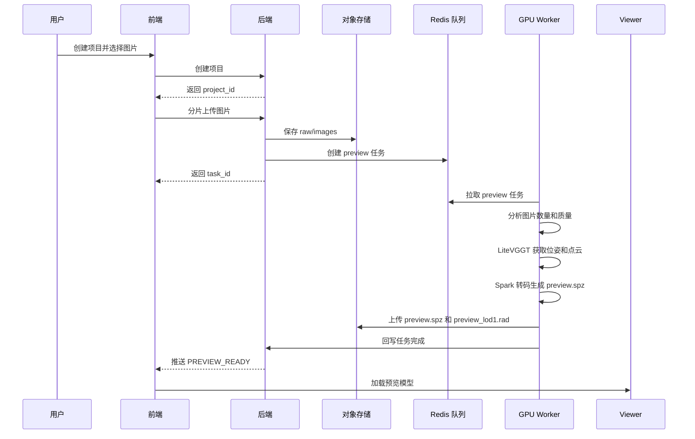
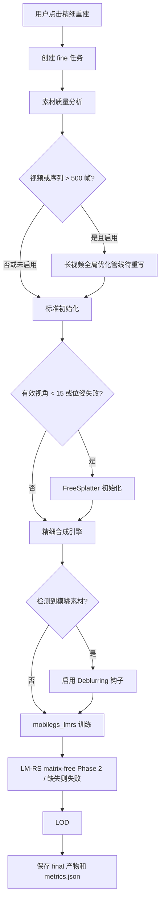
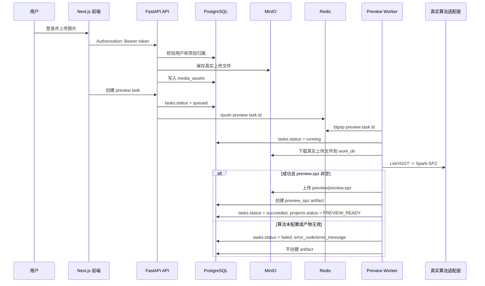

# 核心流程与状态机

## 1. 项目状态机

```text
CREATED
  -> UPLOADING
  -> PREPROCESSING
  -> PREVIEW_RUNNING
  -> PREVIEW_READY
  -> FINE_QUEUED
  -> GLOBAL_OPTIMIZING
  -> FINE_RUNNING
  -> COMPLETED

任意运行中状态
  -> FAILED
  -> CANCELED

COMPLETED
  -> MESH_EXPORT_RUNNING
  -> MESH_EXPORT_READY
```

`GLOBAL_OPTIMIZING` 只在长视频精细重建且开启全局优化时出现。

## 2. 图片极速预览流程



## 3. 视频极速预览流程

视频极速预览管线已清理，待重新设计与实现。当前系统可以保存视频素材，但不会创建视频预览任务或生成视频预览 artifact。

## 4. 实时摄像头粗重建流程

实时摄像头采集页面、分片上传 API 和实时预览管线已清理。新管线实现后再定义录制素材、任务队列、artifact 和 Viewer 加载流程。

## 5. 精细重建流程



## 6. Mesh 导出流程

1. 用户在项目详情页选择导出格式。
2. 后端创建 `mesh_export` 任务。
3. Worker 读取 `final.ply`。
4. Worker 使用 MeshSplatting 生成 `.ply`、`.obj`、`.glb`。
5. 产物上传到对象存储。
6. 后端生成签名 URL 并返回前端。

## 7. 任务优先级

| 任务类型 | 优先级 | GPU 策略 |
| --- | --- | --- |
| 实时摄像头 | 待重写 | 新管线实现后重新定义 |
| 极速预览 | 高 | 可并发，快速返回 |
| LOD 生成 | 中 | 可与部分轻量任务错峰 |
| Mesh 导出 | 中 | 默认独占 GPU |
| 精细重建 | 低 | 默认独占 GPU，长任务 |

## 8. 失败处理

- 上传失败：允许用户重新上传失败分片。
- 预处理失败：项目进入 `FAILED`，保留错误日志。
- 预览失败：允许重新发起预览任务。
- 精细重建失败：保留预览结果，不删除已有产物。
- 导出失败：不影响项目最终重建结果。
- 用户取消：任务进入 `CANCELED`，Worker 应尽快停止并清理临时目录。

## 9. 当前实现同步

当前预览任务的真实执行路径如下：



当前状态规则：

- API 创建预览任务后只允许进入 `queued`；不得在请求线程内直接执行算法。
- worker 接手后进入 `running`，并写入 `worker_id`、`current_stage`、`started_at`。
- 算法环境失败时进入 `failed`，项目进入 `FAILED`，`artifacts` 表不新增成功产物。
- 只有真实非空 `preview.spz` 上传成功后，任务才进入 `succeeded`，项目进入 `PREVIEW_READY`。
- viewer config 存在 `preview_spz` 时返回 `mode=single`；不存在时返回 `unavailable`。视频/实时视频加载语义待新管线重新定义。
- 当前取消接口只持久化 `canceled` 状态；正在执行的外部算法进程中断和临时目录清理属于后续增强。

## 2026-05-07 Fine Workflow Update

Fine image workflow now runs:

1. Normalize uploaded JPG/PNG into RGB JPEG. Missing EXIF is valid; EXIF orientation is only a pixel-rotation hint.
2. Analyze blur and keep at least 3 real images.
3. Run AMB3R-SfM as the production fine frontend. Preview remains LiteVGGT.
4. Write COLMAP-compatible `sparse/0` with `images.bin`, `cameras.bin`, `points3D.bin`, and `points3D.ply`; metrics set `sfm_backend=amb3r_sfm_colmap_no_exif`.
5. Initialize Gaussians with local EDGS/RoMA dense correspondences when `fine_edgs_enabled` is not `false`. This runs after `Scene(...)` and before `training_setup(...)`.
6. Train MobileGS. EDGS mode disables densification by setting `densify_until_iter=0`; final prune behavior remains.
7. Non-sharp inputs enable DeblurMLP GTnet with a default 3000-iteration warmup. After warmup, GTnet activates and xyz learning rate is scaled by `0.1`.
8. Optional LM-RS refinement runs only when explicitly scheduled. Auto DeblurMLP runs keep the default LM start at the final iteration so training does not optimize the blurred observation with LM-RS unless requested.
9. Export standard `final.ply`, transcode `final_web.spz`, and write `metrics.json`.

`pycolmap` is no longer an automatic failure recovery path. It is a development diagnostic path only when `fine_sfm_backend=pycolmap` is explicitly provided. The deprecated `fine_sfm_backend=litevggt` fine option maps to AMB3R-SfM; preview LiteVGGT is unchanged.

EDGS/RoMA defaults are `matches_per_ref=15000`, `nns_per_ref=3`, `num_refs=len(train cameras)`, and `roma_model=outdoor`. The project keeps only `backend/app/fine/edgs_runtime/` for initialization and does not include EDGS training, UI, Gradio, full configs, or the original repository tree.
