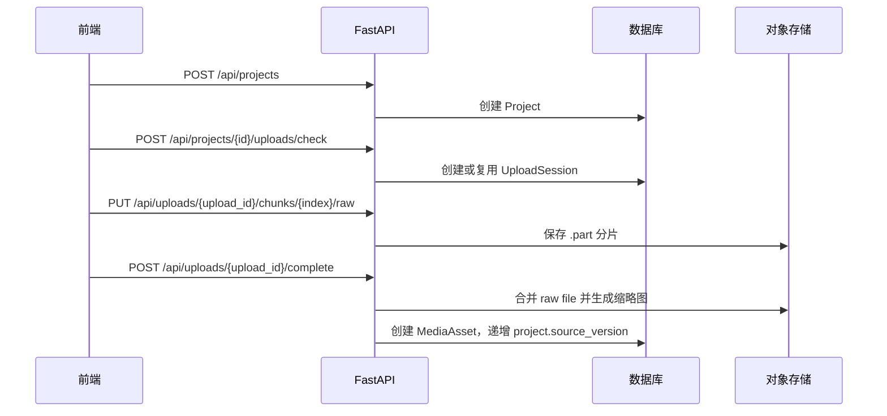
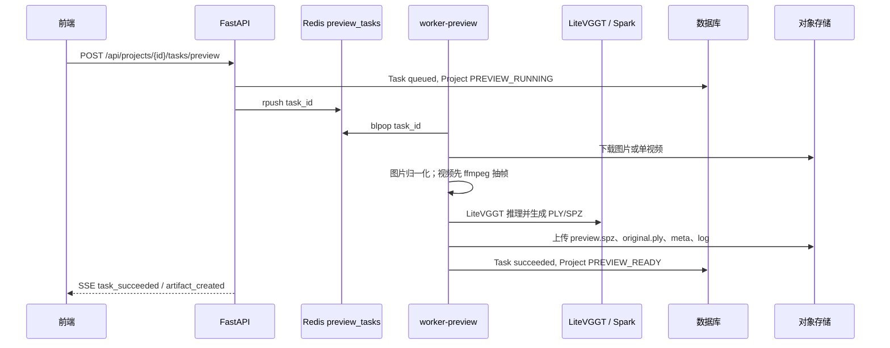
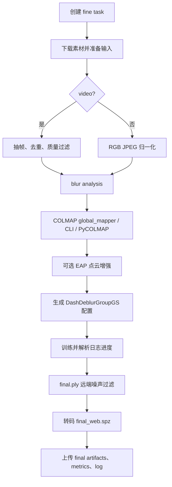

# 核心流程与状态机

## 1. 项目状态

当前前端类型定义包含以下项目状态：

```text
CREATED
UPLOADING
PREPROCESSING
PREVIEW_RUNNING
PREVIEW_READY
FINE_QUEUED
GLOBAL_OPTIMIZING
FINE_RUNNING
COMPLETED
FAILED
CANCELED
```

当前代码实际主要使用：

- `CREATED`：项目创建完成。
- `UPLOADING`：上传或补传素材后。
- `PREVIEW_RUNNING`：预览任务入队或运行。
- `PREVIEW_READY`：当前 source version 的预览产物可用。
- `FINE_QUEUED`：精细重建任务入队。
- `FINE_RUNNING`：精细重建 worker 已接手。
- `COMPLETED`：精细重建成功。
- `FAILED`：任务失败并写入错误信息。
- `CANCELED`：任务取消接口持久化任务取消状态。

`GLOBAL_OPTIMIZING`、Mesh 导出相关状态和实时摄像头状态仍是规划或遗留类型，不是当前主线。

## 2. 上传流程



补充规则：

- 前端默认分片大小为 `NEXT_PUBLIC_UPLOAD_CHUNK_SIZE`，默认 16MB。
- 后端单分片上限 64MB。
- `uploads/check` 会返回已上传分片；若同一文件已完成，会直接返回 media。
- 图片项目不能上传视频，视频项目不能上传图片。
- 删除素材会更新 `source_version`，若删除当前封面则选择下一个缩略图。

## 3. 预览流程



预览失败规则：

- GPU 不可用、权重缺失、Spark 转码失败或产物为空时任务失败。
- 失败任务会上传日志 artifact，但不会创建成功模型 artifact。
- Viewer 只加载与当前 `project.source_version` 一致的预览 artifact；旧 artifact 返回 stale。

## 4. 精细重建流程



关键规则：

- 图片项目至少 3 张图。
- 视频 fine 要求 exactly one video。
- 默认 `fine_sfm_backend=colmap_global`；`gcolmap/global/global_mapper/colmap_glomap` 归一化为 `colmap_global`。
- `colmap` 和 `colmap_cli` 使用 CLI incremental mapper；`pycolmap` 使用 PyCOLMAP incremental path。
- `fine_deblur_mode` 为 `motion|defocus|sharp`；旧 `mix/auto/automatic` 归一化为 `motion`。
- 运行时拒绝 `fine_edgs_enabled=true`。
- `final_web.spz` 默认必需；显式 `fine_spz_enabled=false` 仅用于离线/调试。

## 5. Viewer 配置流程

`GET /api/projects/{project_id}/viewer-config` 返回：

- 有当前版本 final SPZ 时：`status=ready`、`source=final`、`mode=single`。
- 无 final 但有当前版本 preview SPZ/PLY 时：`status=ready`、`source=preview`。
- 只有旧版本 preview 时：`status=unavailable`、`stale=true`。
- 无模型时：`status=unavailable`。

分享页使用 `GET /api/shared-projects/{share_token}` 返回项目摘要和同一 Viewer 配置。

## 6. 事件通道

前端通过 SSE 订阅：

```text
GET /api/projects/{project_id}/events?token=...
```

常见事件：

- `task_started`
- `task_progress`
- `task_succeeded`
- `task_failed`
- `artifact_created`
- `heartbeat`

事件来源是 `task_events` 表。SSE 会先推送最近事件，再持续轮询新事件。

## 7. 取消与失败处理

- 取消接口：`POST /api/tasks/{task_id}/cancel`，会把 queued/running task 标记为 `canceled`。
- worker 在关键节点检查 canceled 状态；已启动的外部训练进程中断仍属于后续增强。
- 失败时任务写入 `error_code`、`error_message`、日志和事件；项目进入 `FAILED`。
- 精细重建失败不删除已有预览 artifact。
